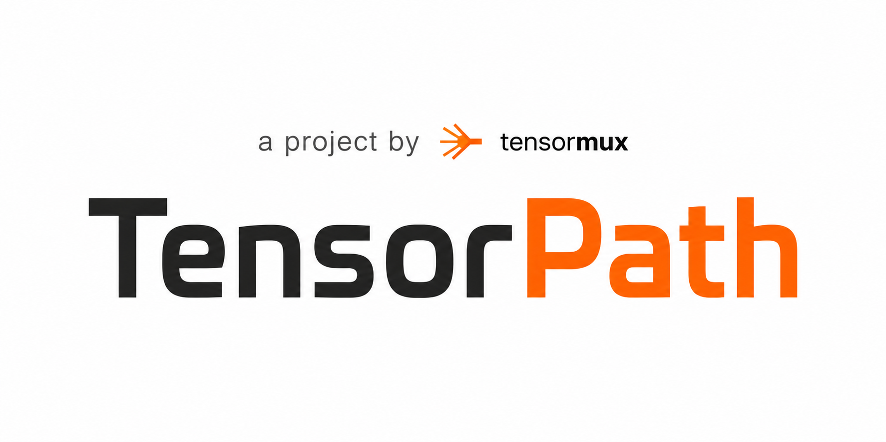

<p align="center">
  
</p>

<p align="center">The inference optimization control plane for LLMs.</p>

<p align="center">
  <a href="https://discord.gg/8YtSjhaVJJ"></a>
  <a href="https://www.tensormux.com/"></a>
  <a href="https://www.linkedin.com/company/tensormux/"></a>
</p>

---

# TensorPath — Inference Optimization Control Plane

> Part of the [TensorMux](https://www.tensormux.com/) open-source ecosystem.

TensorPath tells you the best way to serve an LLM. Give it a model, a workload, and what you care about — latency, throughput, or cost — and it picks the optimal GPU + backend + quantization combination, explains why, and hands you a deployment-ready config. It also ships a kernel optimization layer (Forge) that can autonomously generate and verify faster Triton kernels for specific GPU + dtype + shape combinations.

## What it does

**Recommender** — turns workload intent into an optimized deployment plan
- Generates candidate plans (GPU × backend × quantization) for a model
- Filters out anything that won't fit in VRAM or beats your budget
- Scores each on multiple dimensions with workload-aware metrics
- Ranks them, explains the top pick, exports a deployment artifact
- Compares plans across models (`/compare`)
- Shows cost-per-token efficiency ($/M tokens) for each plan

**Forge** — verified kernel optimization layer
- Retrieves expert playbooks from `@krxgu/kernel-skills` (npm)
- Either generates an agent-ready prompt for you to use elsewhere (manual mode)
- Or runs an autonomous loop with Claude Opus 4.7 that writes the kernel itself (agentic mode)
- Validates correctness with pytest against a PyTorch reference, benchmarks against baseline, refuses to promote anything below 1.10× speedup
- Verified kernels land in a registry that the recommender annotates onto plan results

## Quick start

```bash
# python 3.11+
pip install -r requirements.txt

# Node 18+ for kernel-skills (via npm)
bash scripts/install_kernel_skills.sh

# (optional, for agentic Forge) drop your Anthropic key in .env
cp .env.example .env
# edit .env and paste your sk-ant-api03-...

# run the server
python -m uvicorn app.main:app --reload --port 8000
```

Then visit http://localhost:8000/

## Three ways to use it

### 1. Web UI
| URL | What |
|---|---|
| `/` | Recommendation form |
| `/compare` | Side-by-side comparison across models |
| `/forge` | Kernel optimization runs + verified-kernel registry |
| `/forge/runs/<id>/agentic` | Live dashboard for an autonomous Forge run |

### 2. JSON API
```bash
# recommend
curl -X POST http://localhost:8000/api/recommend \
  -H 'Content-Type: application/json' \
  -d '{"model_id":"qwen2.5-7b","workload_type":"chat","optimization_priority":"cost","constraints":{"max_p95_latency_ms":250,"max_monthly_budget_usd":300}}'

# compare two models
curl -X POST http://localhost:8000/api/compare \
  -H 'Content-Type: application/json' \
  -d '{"model_ids":["qwen2.5-7b","llama3.2-3b"],"workload_type":"chat","optimization_priority":"balanced"}'

# kick off an autonomous Forge run
curl -X POST http://localhost:8000/api/forge/runs \
  -H 'Content-Type: application/json' \
  -d '{"op":"rmsnorm","language":"triton","target_gpu":"RTX 4070","dtype":"fp16","shape":{"batch":16,"hidden_size":4096}}'
# then start the agent against the returned run_id:
curl -X POST http://localhost:8000/api/forge/runs/<run_id>/agentic \
  -d '{"max_iterations":5,"cost_cap_usd":3.0}'
```

OpenAPI docs at `/docs`.

### 3. CLI
```bash
# Forge from the terminal (no server required)
python scripts/forge.py create --op rmsnorm --language triton \
    --gpu "RTX 4070" --dtype fp16 --batch 16 --hidden-size 4096
python scripts/forge.py verify    --run-id <run_id>
python scripts/forge.py benchmark --run-id <run_id>
python scripts/forge.py promote   --run-id <run_id>
python scripts/forge.py list-kernels

# tiny smoke-test of the recommender (no server)
python scripts/demo.py
```

## Project structure

```
app/
  api/             FastAPI routes (/api/* + /api/forge/*)
  ui/              Jinja templates + UI handlers
  schemas/         pydantic data contracts
  services/
    recommender/         candidate generation + scoring + ranking
    benchmark_store/     loads + queries benchmark profiles
    runtime_registry/    backend capabilities (vLLM, TensorRT-LLM)
    deployment/          DeploymentConfig export
    explanation/         "why this plan won" text
    optimization/        plan-annotation passes (KernelRegistryPass)
    forge/               kernel-skills, prompt builder, gates, agentic loop
  kernels/triton/        verified kernel source files
benchmarks/
  profiles/        benchmark JSON (priors + measured)
  runners/         vLLM-driven measurement tool
  kernels/         shared bench utils (warmup, CUDA sync, percentiles)
kernel_registry/   verified_kernels.json (the source of truth)
forge_runs/        per-run artifacts (gitignored except .gitkeep)
docs/              FORGE.md, KERNEL_REGISTRY.md, BENCHMARKING.md, CLAIMS.md
scripts/           forge CLI + demo
tests/             209 unit tests + 1 opt-in integration test
```

## Supported surface (MVP)

**models:** Qwen 2.5 7B, Qwen 2.5 3B, Llama 3.1 8B, Llama 3.2 3B  
**GPUs:** L4, L40S, A100-80GB, H100 (datacenter); RTX 4070 (local for measured profiles)  
**backends:** vLLM, TensorRT-LLM  
**quantizations:** FP16, BF16, FP8, AWQ 4-bit, GPTQ 4-bit  
**priorities:** latency, throughput, cost, balanced  

## How scoring works

Each candidate is scored on five dimensions:

1. **latency** — relative to the candidate set; bonus for headroom under user target, penalty proportional to overshoot
2. **throughput** — tokens/sec, plus a hard penalty if `min_throughput_tps` not met
3. **cost** — hourly rate; bonus when comfortably under budget, heavy penalty when over
4. **quality** — quantization degradation (FP16=1.00, FP8=0.96, AWQ=0.88, GPTQ=0.86)
5. **simplicity** — operational complexity of the backend (vLLM is simpler than TensorRT-LLM)

Weights shift based on `optimization_priority`. Hard constraints (VRAM, budget × 2, latency, throughput) filter or crush the score before ranking.

## Workload-aware scoring

Different workloads have different priorities. TensorPath adjusts scoring based on workload type:

| Workload | Primary Metrics | Rationale |
|----------|----------------|-----------|
| **CHAT** | TTFT (60%) + ITL (40%) | Fast first token + smooth streaming |
| **CODEGEN** | ITL (50%) + throughput (20%) | Smooth streaming for long outputs |
| **SUMMARIZATION** | TTFT (70%) | Fast prefill for long inputs |
| **BATCH** | Throughput only | Latency doesn't matter |
| **EMBEDDING** | Concurrent throughput | No generation, batch processing |

Each workload type uses the most relevant metrics from your benchmark data.

## Benchmark data

Profiles live in `benchmarks/profiles/` as JSON, labeled with their source: `measured`, `estimated`, or `imported`. We don't fake precision — if a number is estimated, it says so.

### Measured profiles (RTX 4070, single-request, vLLM)

| Model        | Quant | p95 TTFT | Tok/s |
|--------------|-------|----------|-------|
| Qwen 2.5 7B  | AWQ   | 160 ms   | 79    |
| Llama 3.1 8B | AWQ   | 161 ms   | 81    |
| Llama 3.2 3B | AWQ   | 122 ms   | 113   |
| Qwen 2.5 3B  | FP16  | 195 ms   | 66    |

To add more:
```bash
python benchmarks/runners/bench.py --model <id> --quantization <quant>
```
Gated repos (Meta Llama) need either `huggingface-cli login` or `HF_TOKEN` exported.

## Forge — kernel optimization layer

Two modes, same gates.

**Manual mode.** You fill the Forge form, get a 75 KB strict markdown prompt with a curated kernel-skills bundle. Hand it to your own coding agent (Claude Code, Cursor, etc.) or write the kernel yourself, drop the five required files into `forge_runs/<id>/candidate/`, then click verify → benchmark → promote.

**Agentic mode** (requires `ANTHROPIC_API_KEY`). Same form, but check the "Autonomous" box. Forge launches a background loop that calls Claude Opus 4.7 with a tool-use surface (`write_candidate_file`, `run_verify`, `run_benchmark`, etc.), iterates up to 5 times under a $3 cost cap, and on success copies the verified Triton kernel into `app/kernels/triton/verified/<op>/<kernel_id>.py` and registers it. A live dashboard shows status, cost, iteration count, gate badges, and a scrolling transcript.

Real promoted kernels in this repo (RMSNorm on RTX 4070, fp16, batch=16, hidden_size=4096):

```
app/kernels/triton/verified/rmsnorm/
  triton_rmsnorm_rtx4070_fp16_b16_h4096_v1.py    # 3.66x vs torch eager
  triton_rmsnorm_rtx4070_fp16_b16_h4096_v2.py    # 3.66x
  triton_rmsnorm_rtx4070_fp16_b16_h4096_v3.py    # 3.63x  (tightest implementation)
```

These were written by the agent, verified against a PyTorch RMSNorm reference at multiple shapes including non-power-of-two, and benchmarked at 200 iterations after 25 warmup iterations.

## Reliability features

- **Atomic writes**: All JSON files use write-to-temp-then-rename pattern to prevent corruption
- **Retry logic**: Agentic loop retries transient API errors (429, 500, 502, 503, 504, 529) with exponential backoff
- **Abort handling**: Race condition fix ensures abort requests are preserved across state saves
- **Cost tracking**: Agent is aware of remaining budget and can make cost-conscious decisions
- **Promotion safety**: Verify and benchmark gates must pass in the same iteration before promotion

## Why kernel-skills is used

TensorPath uses [`@krxgu/kernel-skills`](https://www.npmjs.com/package/@krxgu/kernel-skills) as an external instruction source for CUDA, Triton, quantization, benchmarking, and kernel optimization workflows.

`kernel-skills` provides reusable expert playbooks. TensorPath does not depend on it for execution, benchmarking, compilation, or deployment.

All execution happens inside Forge. Forge retrieves skill bundles, creates agent-ready prompts, accepts generated candidate kernels, validates correctness, benchmarks performance, and promotes only verified kernels into the local kernel registry.

## Documentation

- [docs/FORGE.md](docs/FORGE.md) — full Forge pipeline, agentic loop, hardware constraints
- [docs/KERNEL_REGISTRY.md](docs/KERNEL_REGISTRY.md) — registry schema, kernel ID format, evidence levels, promotion rules
- [docs/BENCHMARKING.md](docs/BENCHMARKING.md) — measurement protocol (warmup, sync, percentiles), output schema, threshold rules
- [docs/CLAIMS.md](docs/CLAIMS.md) — what we are and aren't allowed to say about kernel speedups

## Testing

```bash
# default (no GPU required)
pytest -q                # 209 passed, 1 skipped

# CUDA-required tests (real GPU)
pytest -m cuda -q
```

The single skipped test is the kernel-skills CLI integration test, opt-in via `NEEVPATH_FORGE_INTEGRATION=1`.

## Contributing

TensorPath is open source under [github.com/tensormux](https://github.com/tensormux). PRs welcome — see the docs folder for architecture details before opening a large change.

## What's next

- [x] benchmark runner with measured RTX 4070 profiles
- [x] UI: server-rendered Jinja templates at `/`, `/compare`, `/forge`
- [x] comparison endpoint + side-by-side cards
- [x] Forge: kernel-skills-driven optimization with verify + benchmark + promote gates
- [x] verified kernel registry annotated onto recommendation results (op-level evidence)
- [x] autonomous agentic mode with Claude Opus 4.7 orchestrator
- [x] real promoted Triton kernels in the registry (RMSNorm on RTX 4070)
- [x] workload-aware scoring for CHAT, CODEGEN, SUMMARIZATION, BATCH, EMBEDDING
- [x] cost-per-token metric ($/M tokens) displayed in recommendations
- [x] retry logic for transient API errors (agentic loop)
- [x] atomic writes for JSON files (prevents corruption)
- [x] agent cost awareness (budget tracking in agentic loop)
- [x] promotion trigger fix (gates must pass in same iteration)
- [x] 209 unit tests (up from 93)
- [ ] live deployment integration (currently exports config artifact only)
- [ ] runtime-level integration of promoted kernels (currently op-level evidence only — see docs/CLAIMS.md)
- [ ] more ops in Forge: fused add+RMSNorm, softmax, sampling, KV cache append, dequant, RoPE
